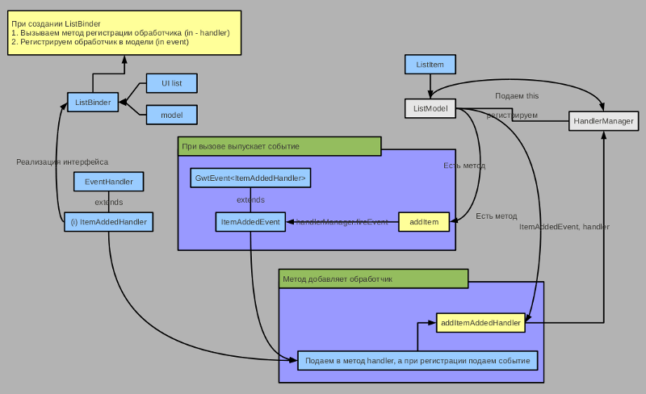

1. GWT Activities и Places (составляющие встроенного MVP)
   ------------------------------------------------------
* `Блог о Java технологиях ** Creating and handling GWT сustom events`: [dmitrynikol.blogspot.com/2012/06/gwt-ustom-events](http://dmitrynikol.blogspot.com/2012/06/gwt-ustom-events.html) | [CustomGwtEvent.7z](http://dl.dropbox.com/u/5316293/blogspot/Event/CustomGwtEvent.7z)
| ([java-gravity-ping-pong](https://github.com/dmitrynikol/java-gravity-ping-pong))

* `Для того чтобы понимать как строятся пользовательские события мы будем использовать стиль Model-Binder-View`: [article_15](http://www.spring-source.ru/articles.php?type=manual&theme=articles&docs=article_15) ([article_16](http://www.spring-source.ru/articles.php?type=manual&theme=articles&docs=article_16) | [article_17](http://www.spring-source.ru/articles.php?type=manual&theme=articles&docs=article_17) | [article_18](http://www.spring-source.ru/articles.php?type=manual&theme=articles&docs=article_18) | [article_19](http://www.spring-source.ru/articles.php?type=manual&theme=articles&docs=article_19) | [article_20](http://www.spring-source.ru/articles.php?type=manual&theme=articles&docs=article_20))

